# Documentación Técnica: ChefOS - Kitchen Manager v2

**Fecha:** 20 de Diciembre de 2025
**Versión:** 2.0.0
**Autor:** Antigravity AI

---

## 1. Descripción General
**ChefOS** es una plataforma integral de gestión ("Kitchen OS") diseñada para modernizar y optimizar las operaciones de cocinas profesionales. La aplicación centraliza la gestión de inventario, recetas, menús, personal, compras y seguridad alimentaria (HACCP), integrando capacidades de **Inteligencia Artificial** para automatizar tareas repetitivas y generar insights de valor.

## 2. Stack Tecnológico y Herramientas

La aplicación está construida utilizando un stack moderno y escalable:

### Frontend
- **Framework:** React 19
- **Build Tool:** Vite (Ultra-rápido HMR y build)
- **Lenguaje:** TypeScript (Tipado estático robusto)
- **Estilos:** TailwindCSS (Diseño utility-first, responsive y dark mode)
- **Iconografía:** Lucide React

### Gestión de Estado y Datos
- **State Management:** Zustand (Gestión ligera y persistente del estado global)
- **Base de Datos:** Firebase Firestore (NoSQL, tiempo real)
- **Autenticación:** Firebase Auth
- **Funciones:** Firebase Cloud Functions

### Inteligencia Artificial
- **Modelo:** Google Gemini (vía Vertex AI / Firebase Extensions)
- **Capacidades:** Generación de menús, enriquecimiento de datos de ingredientes, escaneo de facturas (OCR) y asistente de cocina conversacional.

### Otras Librerías Clave
- `@dnd-kit`: Drag and drop para kanban y planificación.
- `react-router-dom`: Enrutamiento SPA.
- `date-fns`: Manipulación de fechas.
- `recharts`: Visualización de datos y gráficas.

---

## 3. Estructura de Archivos

La estructura del proyecto (`src/`) sigue una arquitectura modular y escalable:

- **`/components`**: Bloques de construcción de la UI.
  - `/common`: Componentes reutilizables (Botones, Inputs, Modales).
  - `/auth`: Protección de rutas y formularios de acceso.
  - `/ai`: Componentes específicos de IA (Chat, Generadores).
  - Vistas principales (`InventoryView`, `RecipesView`, etc.).
- **`/store`**: Slices de Zustand para cada dominio (Store pattern).
  - `createIngredientSlice.ts`, `createRecipeSlice.ts`...
- **`/services`**: Capa de abstracción para APIs externas.
  - `geminiService.ts`: Comunicación con IA.
  - `firebase.ts`: Configuración de backend.
- **`/hooks`**: Custom hooks para lógica compartida (`useAuth`, `useDebounce`).
- **`/types`**: Definiciones de tipos TypeScript compartidas.

---

## 4. Guía de Funcionalidades y Módulos

A continuación se detalla cada módulo funcional de la aplicación con sus respectivas capturas de pantalla.

### 4.1 Dashboard Principal
El centro de control de ChefOS. Ofrece una vista rápida de las métricas clave: ventas, alertas de stock bajo, tareas pendientes y estado del equipo.
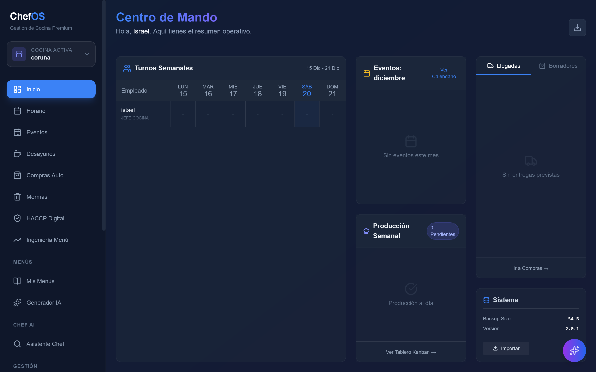

### 4.2 Gestión de Inventario
Control de stock en tiempo real. Permite filtrar por categorías, ubicaciones y ver el valor total del inventario. Incluye alertas automáticas de caducidad.
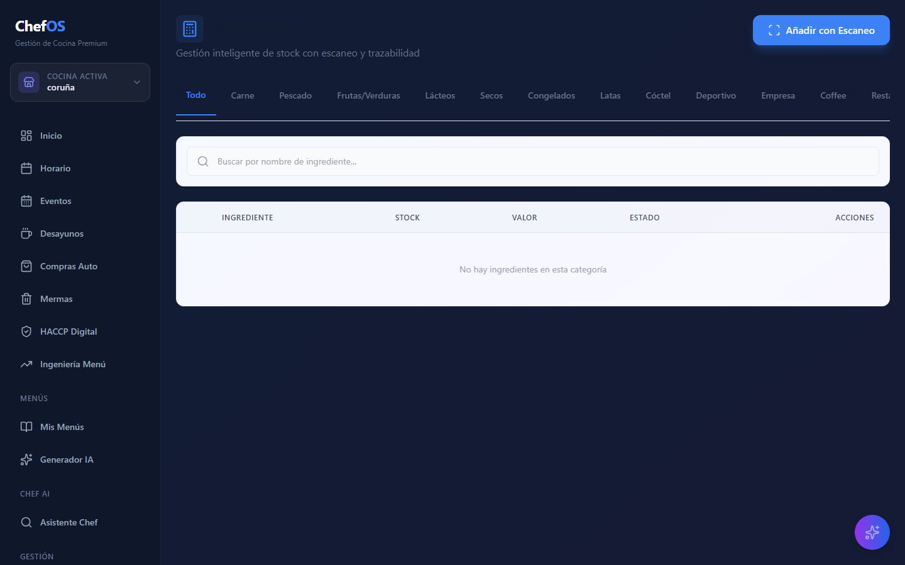

### 4.3 Gestión de Recetas (Fichas Técnicas)
Creación y mantenimiento de recetas estándar. Calcula costes automáticos basados en ingredientes, gestiona alérgenos y precios de venta sugeridos.
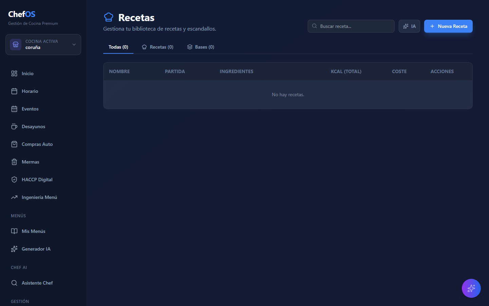

### 4.4 Ingeniería de Menús
Herramienta de planificación y análisis. Permite organizar menús semanales y visualizar el rendimiento de los platos (Rentabilidad vs Popularidad).
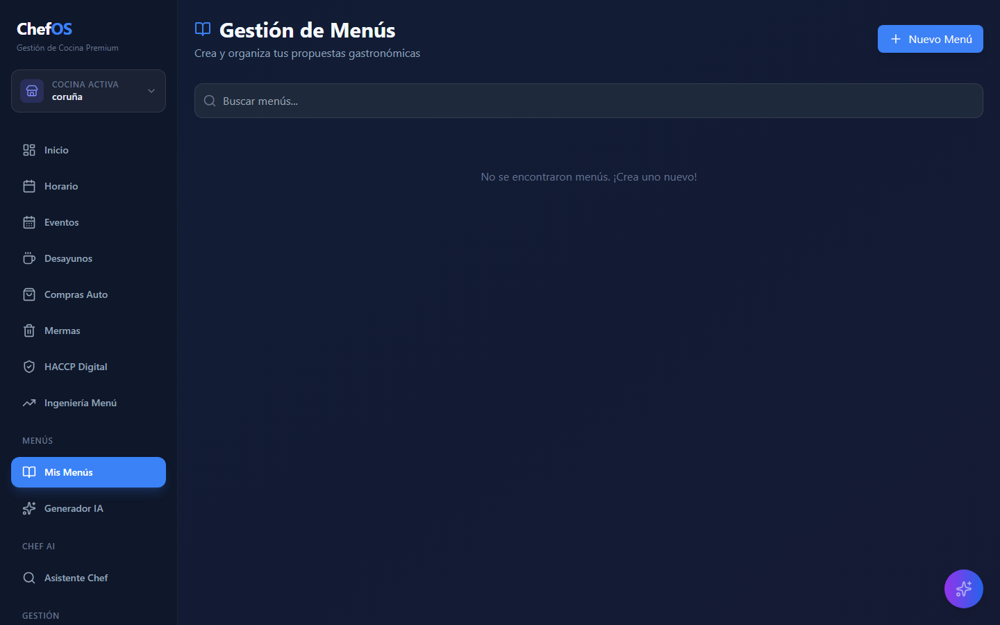

#### Análisis de Rendimiento (Matrix BCG)
Visualización gráfica para la toma de decisiones sobre la oferta gastronómica.
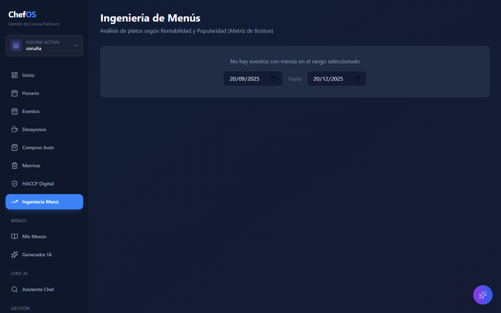

### 4.5 Gestión de Personal
Administración del cuadro de turnos (Roster), roles de empleados, control de asistencia y gestión de bajas laborales.
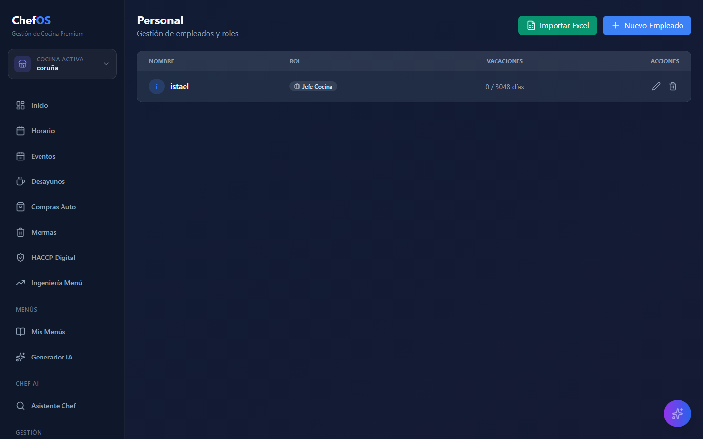

### 4.6 Proveedores y Compras
Base de datos de proveedores y gestión centralizada de pedidos.
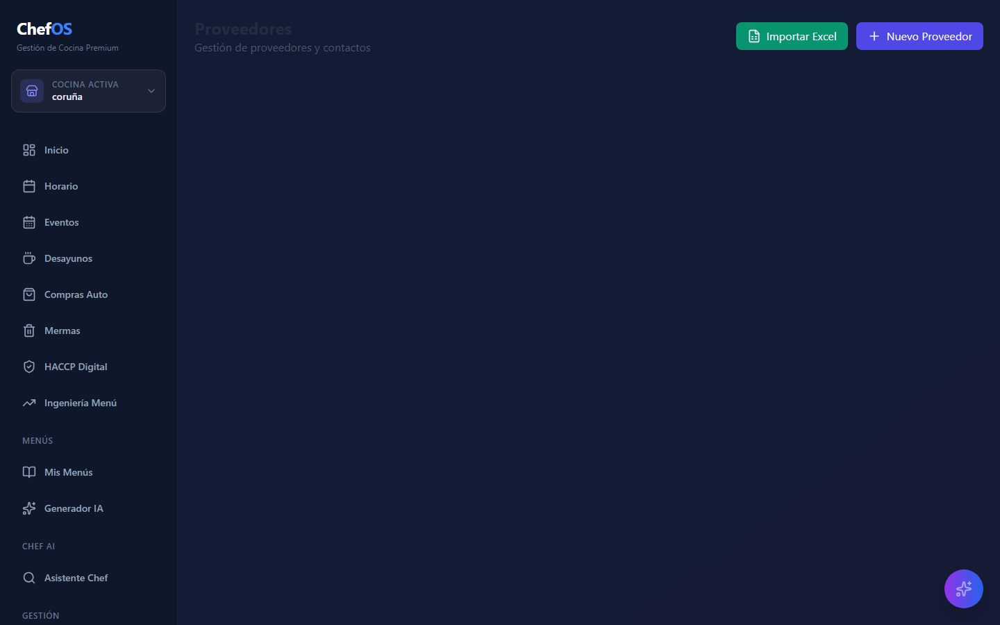

El módulo de compras automatiza la reposición de stock basándose en mínimos establecidos.
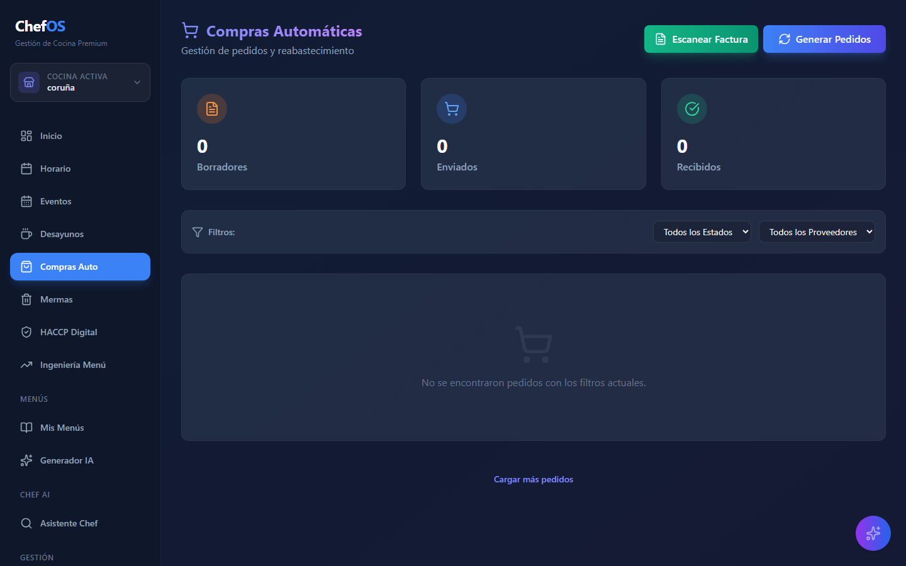

### 4.7 Control de Mermas (Waste Awareness)
Registro detallado de desperdicios para control de costes y sostenibilidad. Permite categorizar por tipo (caducidad, producción, rotura).
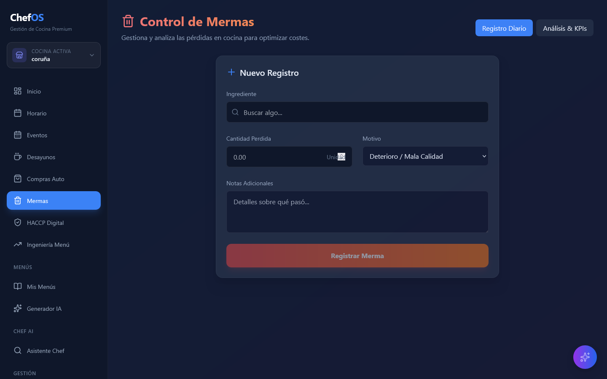

### 4.8 Gestión de Eventos
Calendario integrado para catering y eventos especiales, vinculando menús y personal necesario.
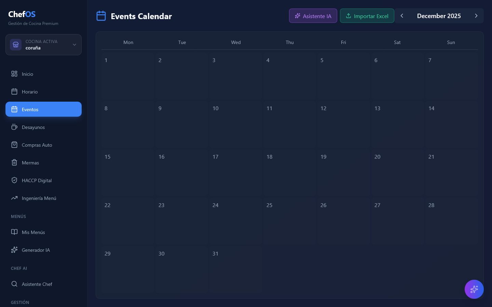

### 4.9 Chef AI (Inteligencia Artificial)
Herramientas avanzadas de IA integradas en el flujo de trabajo:

**Generador de Menús:** Crea propuestas de menús equilibrados y creativos automáticamente.
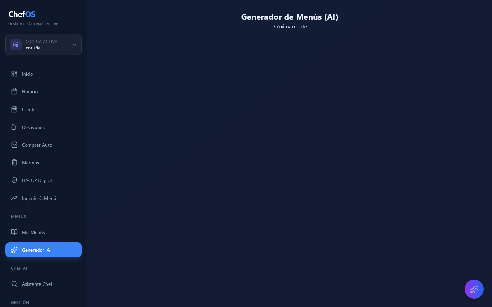

**Asistente Virtual:** Chatbot especializado para consultas culinarias y búsqueda inteligente.
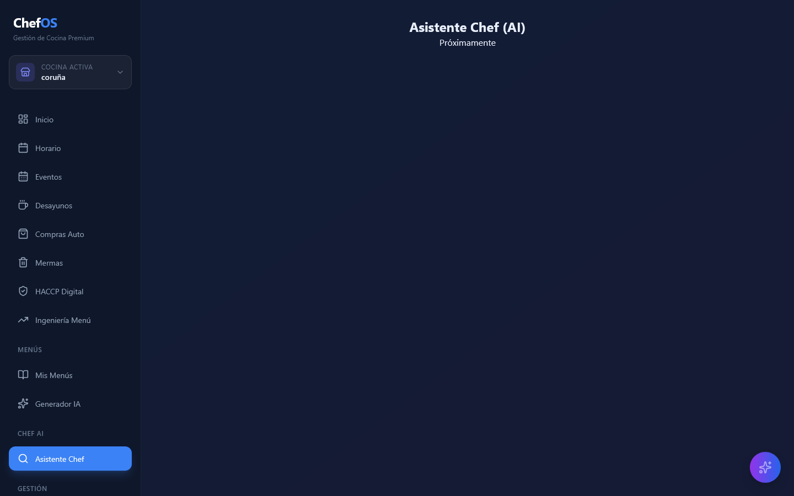

---

**© 2025 Antigravity Kitchen Management Systems**
