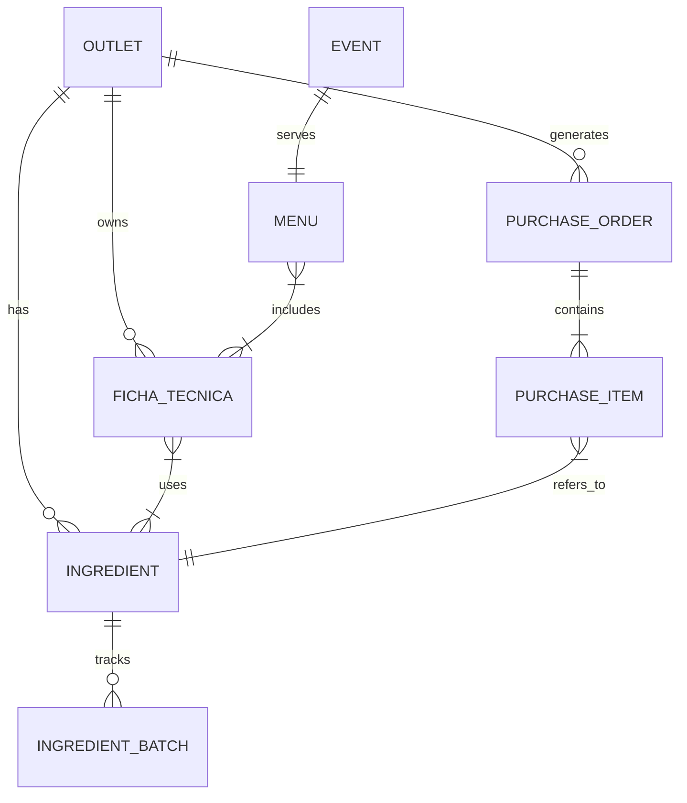

# Esquema y Arquitectura Firestore - ChefOS

## 1. Visión General
ChefOS utiliza **Cloud Firestore** como base de datos NoSQL en tiempo real. La arquitectura está diseñada para soportar **multi-tenancy** a través del campo `outletId` en todas las colecciones principales.

## 2. Colecciones Principales

### `ingredients` (Inventario)
Maestro de ingredientes y control de stock.
*   **Document ID:** UUID v4
*   **Campos Clave:**
    *   `outletId`: ID del restaurante.
    *   `stock`: Stock total (suma de lotes).
    *   `costPerUnit`: Costo actual.
    *   `batches`: Array de objetos `IngredientBatch` (Sub-colección lógica desnormalizada).
*   **Patrones de Acceso:**
    *   Sync en tiempo real filtrado por `outletId`.
    *   Lectura en bloque (`where('__name__', 'in', ids)`) para cálculo de costos.

### `recipes` vs `fichasTecnicas`
*   **`recipes`:** Modelo simplificado legacy.
*   **`fichasTecnicas`:** Modelo avanzado con versionado, costos detallados y pricing.
    *   **Relación:** Una Ficha Técnica puede crearse a partir de una Receta.
    *   **Sub-colección (Lógica):** `versionesFichas` almacena snapshots históricos.

### `productionTasks` (Kanban)
Tareas de producción generadas automáticamente o manualmente.
*   **Optimización:**
    *   La sincronización filtra tareas por `date >= 7 días atrás` para evitar sobrecarga.
    *   Índice Compuesto: `outletId ASC, date ASC`.

### `purchaseOrders` (Compras)
Órdenes de compra a proveedores.
*   **Estados:** `DRAFT` -> `APPROVED` -> `ORDERED` -> `RECEIVED`.
*   **Optimización:**
    *   La sincronización filtra órdenes por `date >= 30 días atrás`.
    *   Índice Compuesto: `outletId ASC, date DESC`.

## 3. Relaciones (ERD Lógico)

## 4. Patrones de Optimización

### Batched Reads (N+1 Solution)
Para cálculos masivos (ej. costos de una receta con 20 ingredientes), no iteramos lecturas. Usamos `where(documentId(), 'in', chunk)` para traer todos los ingredientes en una sola request por lote de 10.

### Partial Denormalization
*   **Fichas Técnicas:** Guardan `costoUnitario` histórico del ingrediente en el momento del cálculo. Esto permite ver el costo histórico sin recalcular, a menos que se solicite explícitamente.
*   **Batches:** Se guardan dentro del documento `ingredient` para atomicidad en transacciones de inventario (FIFO).
