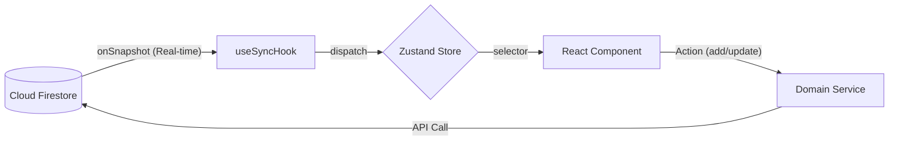

# Gestión de Estado y Sincronización - ChefOS

## 1. Arquitectura Flux (Zustand)

Utilizamos **Zustand** para el estado global, dividido en "Slices" por dominio.

### Estructura del Store
```typescript
interface AppState {
  // Slices
  ...IngredientSlice,
  ...ProductionSlice,
  ...PurchaseSlice,
  // ...otros dominios

  // UI State Global
  activeOutletId: string | null;
}
```

## 2. Patrón "Real-Time Sync Hooks"

En lugar de usar `useEffect` dispersos para fetching de datos, centralizamos la lógica en **Sync Hooks** (`src/hooks/sync/`).

### Flujo de Datos
1.  Componente monta -> Llama a `useProductionSync()`.
2.  Hook detecta `activeOutletId`.
3.  Hook establece suscripción `onSnapshot` a Firestore con filtros optimizados.
4.  Firestore emite nuevos datos -> Hook despacha acción de Zustand (ej. `setProductionTasks`).
5.  Componentes UI re-renderizan reactivamente.

### Optimización de Sincronización
Para evitar costos excesivos de lectura y uso de memoria, implementamos "Ventanas de Tiempo":

*   **Producción:** `date >= HOY - 7 días`.
*   **Compras:** `date >= HOY - 30 días`.

### Diagrama de Flujo de Datos


