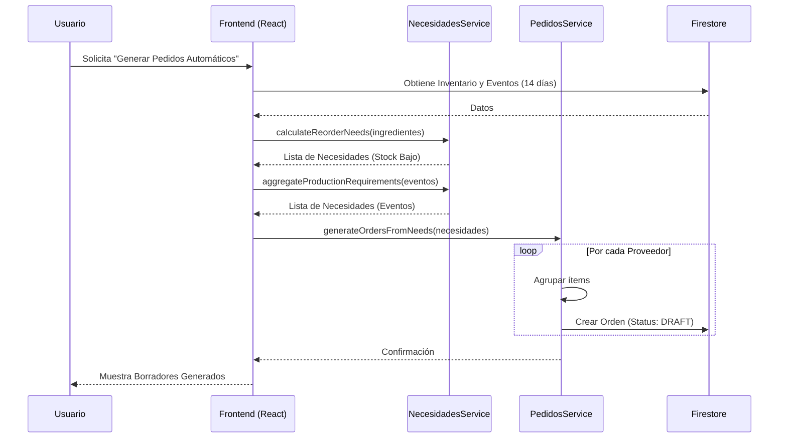

# Guía de Usuario: Compras Automáticas

## 1. Introducción
El módulo de Compras Automáticas analiza su inventario, recetas y eventos futuros para sugerir pedidos inteligentes. El sistema planifica con un horizonte de **14 días**.

## 2. Flujo de Trabajo

### Paso 1: Configuración de Parámetros
Cada ingrediente debe tener configurados sus parámetros de stock para que la automatización funcione:
*   **Punto de Pedido (Reorder Point):** Nivel mínimo de stock antes de pedir.
*   **Stock Óptimo (Optimal Stock):** Cantidad ideal a mantener.
*   **Proveedor Preferido:** A quién se le pide por defecto.

### Paso 2: Generación de Necesidades
El sistema calcula las necesidades basándose en dos fuentes:
1.  **Reposición (Stock Bajo):** Ingredientes por debajo del Punto de Pedido.
2.  **Producción Futura:** Ingredientes necesarios para Eventos confirmados en los próximos 14 días.

### Paso 3: Revisión de Borradores
El sistema genera órdenes en estado `BORRADOR (DRAFT)`, agrupadas por proveedor.
1.  Navegue a la vista de "Compras".
2.  Revise las cantidades sugeridas.
3.  Edite, añada o elimine ítems según su criterio.

### Paso 4: Aprobación y Envío
1.  Haga clic en "Aprobar" para bloquear la orden.
2.  Haga clic en "Enviar" para registrar el envío (o integración futura por email).

---

## 3. Lógica del Sistema (Diagrama)

